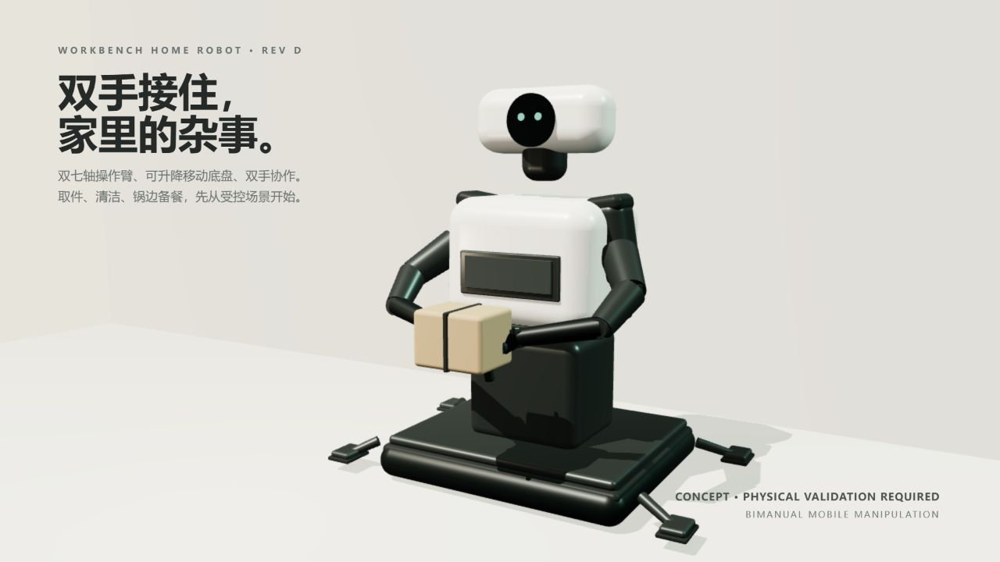

# Workbench Desk Robot

> **Verify before you say done.**
>
> Workbench Home Robot is an evidence-first foundation for mobile domestic
> manipulators:
> bounded actions, replayable event logs, and a verifier that can say
> **confirmed**, **refuted**, or **insufficient evidence** instead of guessing.



[Explore the interactive 3D product view](docs/assets/premium-product-render.html)

The hero shows the bimanual parcel-assist pose; cleaning and supervised induction tools
are separate quick-change concepts, not simultaneous performance claims.

[](pyproject.toml)
[](LICENSE)
[](#honest-status)

[简体中文](README.zh-CN.md)

The project is built around one practical question: **did the robot actually
complete the task, and can we prove it?**

The current mechanical baseline is **Revision D**: a 540 x 520 mm stabilized
mobile base, 350 mm braked liftable torso, two seven-axis arms, 18 L parcel bay,
and locked quick-change tools. Bimanual parcel handling, cleaning, and induction-cooking assistance
are target capabilities under physical validation; the visual is not a claim of
an assembled or certified product.

## Why It Matters

Most robot demos treat a successful command as a successful task. That is how a
robot can report “placed” while the part is still on the floor.

Workbench separates the layers that are usually blurred together:

1. **Intent** — the model chooses from bounded semantic actions.
2. **Execution** — trusted runtime code dispatches and records what happened.
3. **Verification** — evidence is evaluated after the action, with no silent success.
4. **Replay** — the complete event trail can be inspected and reconstructed.

## What You Can Try Today

The repository currently ships a deterministic, offline tabletop runtime. It
covers placement, three-part kitting, inspection, obstacle-clearance recovery,
and evidence-first parcel intake.

```bash
python tools/scripts/sim_cli.py doctor
python tools/scripts/sim_cli.py list
python tools/scripts/sim_cli.py run normal-001 --runner scripted --output-dir runs/demo
python tools/scripts/demo_scripted.py
```

The scripted runner creates an inspectable artifact containing the source
manifest, materialized scene, event log, stdout/stderr, metadata, and checksums.
It is deliberately labelled `SCRIPTED_FIXTURE` and `release_eligible: false`.

## Core Contributions

**Evidence-first verification**

- Three-valued task status: `confirmed`, `refuted`, `insufficient_evidence`
- Structured evidence references instead of a bare pass/fail bit
- Post-action checks that retain failed attempts and recovery history

**Contract-driven runtime**

- 11 JSON schemas define module boundaries
- Strict ingress validation and matching Pydantic models
- Append-only event store with deterministic replay from checkpoints

**Bounded agent behavior**

- Model routes only to semantic actions such as `observe`, `grasp`, `place`,
  `ask_confirm`, `express`, and `stop`
- Joint positions, velocities, and emergency stop remain outside model reach
- Dangerous or mixed-boundary goals fail closed

**Operator visibility**

- Read-only dashboard for task status, evidence, recovery, and replay
- `doctor`, `list`, and `run` simulation controls with explicit execution states
- Atomic run artifacts with raw logs, metadata, and SHA-256 checksums

## Honest Status

**Works today:** deterministic Python runtime, five task families, replayable
event logs, read-only dashboard, local model routing, scenario validation, and
fail-closed simulation controls.

**Not built yet:** a complete Gazebo world, an executed physical camera bridge,
MoveIt grasp/place adapter, Gazebo-backed task results, and physical hardware
evidence. The camera BSP integration is specified, but package compatibility,
calibration and real sensor data remain `NOT_EXECUTED`. Committed fixtures are
pipeline tests, not robot or Gazebo evidence.

**BSP baseline:** the prototype plan selects one Jetson Orin Nano Super 8 GB
Linux board and six controller domains: base, left/right arm, left/right tool,
and independent safety. The repository includes CAN identity, kernel/service
requirements, firmware compatibility, cost review and fail-closed readiness
checks under [`bsp/`](bsp/). Carrier-board pin/IRQ data, supplier protocols,
boot images, AVL approval and physical bring-up remain blocked or
`NOT_EXECUTED` until real evidence is attached.

The camera baseline is one head-mounted Intel RealSense D435 over USB 3 using
the Linux `uvcvideo`/V4L2 stack, `librealsense2`, and ROS 2
`realsense2_camera`. Wrist cameras are intentionally deferred until a measured
occlusion study justifies their cost. See the
[camera BSP integration](docs/architecture/robot-bsp-camera-v0.1.md).

The reproducibility guarantees are deliberately separate:

1. The same frozen manifest and seed produce the same materialized scene hash.
2. The same valid, ordered event log reduces to the same replay state.
3. The scripted fixture generator emits the same ordered events only when its
   complete input, including versions and configuration, is identical.

A seed alone does not determine event order. None of these guarantees implies
deterministic Gazebo physics, sensor noise, process timing, or physical behavior.

## Validation and Platform Support

The portable Python runtime is tested on Python 3.12. Native Windows support
covers contracts, event processing, the read-only backend, monitoring, task
packet validation, and deterministic fixture workflows. Linux-only features
remain explicitly separate:

| Boundary | Supported evidence | Not implied |
| --- | --- | --- |
| Python runtime | Unit and integration tests on Linux and Windows | Gazebo, ROS 2, or robot motion |
| Containers | Runtime and devcontainer share one immutable Ubuntu digest | Reproducibility on an unpinned base image |
| Dashboard backend | Bounded read-only HTTP API; write methods return `405` | Authentication for public deployment or any control authority |
| `wbcan` | Linux kernel build, virtual SocketCAN fault tests, race-safe counters | Physical CAN timing, MCU behavior, or actuator safety |
| Robot BSP | Selected topology, camera stack, manifests, kernel/service requirements and readiness checks | A bootable Jetson image, installed camera packages, calibration, physical CAN, E-stop or thermal evidence |
| Scripted scenarios | Deterministic fixture artifacts with checksums | Physical or Gazebo execution |

The complete portable check is `python -m pytest`. Linux CI additionally owns
container, MCU-QEMU, and privileged kernel-module gates. A merge is not treated
as validated when any required job fails or is skipped.

## Quickstart

Ubuntu 24.04, WSL2, or Windows 11 with Python 3.12; no GPU is required for the
portable runtime. Kernel-module, ROS 2, and container checks require Linux.

```bash
git clone https://github.com/Quchaosheng/workbench-desk-robot.git
cd workbench-desk-robot
make bootstrap
make demo-scripted
```

On native Windows, install the editable development package and run the
portable checks directly:

```powershell
py -3.12 -m pip install -e ".[dev]"
py -3.12 -m pytest
py -3.12 tools/scripts/demo_scripted.py
```

Useful commands:

```bash
make test             # unit and integration tests
make lint             # Ruff checks
make scenario-check   # manifest validation and deterministic scene checks
make sim-doctor       # diagnose simulator dependencies
make sim-list         # list scenarios and scene hashes
make sim              # configured Gazebo runner; missing Gazebo is NOT_EXECUTED
make dashboard        # read-only local dashboard
```

For an offline fixture, run:

```bash
python tools/scripts/sim_cli.py run normal-001 --runner scripted --output-dir runs/demo
```

For a configured external runner, provide tokenized argv through
`WORKBENCH_GAZEBO_COMMAND` or `--command`. The runner uses each manifest's
timeout, captures bounded stdout/stderr, terminates the process tree on timeout,
and validates the resulting event log before publishing the artifact.

## Architecture Boundary

```text
goal -> bounded planner -> semantic action -> trusted executor
                                      \-> event store -> verifier -> replay/dashboard
```

The dashboard API is read-only. HTTP write methods return `405`; this service
does not publish ROS, motion, MCU, or emergency-stop commands.

## Roadmap

- **v0.1** — frozen regression baseline and evidence contracts
- **v0.2** — five scripted task families and recovery paths
- **Next** — real Gazebo world, perception bridge, semantic motion adapter,
  and simulation fault injectors
- **Later** — hardware validation without changing the evidence boundary

## Documentation

- [User guide](docs/user-guide/index.md)
- [System architecture](docs/architecture/system.md)
- [Simulation boundary](sim/README.md)
- [Deployment](docs/deployment/multi-host.md)
- [Security policy](SECURITY.md)
- [Contributing](CONTRIBUTING.md)

## License

Apache-2.0. See [LICENSE](LICENSE) and [NOTICE](NOTICE).
