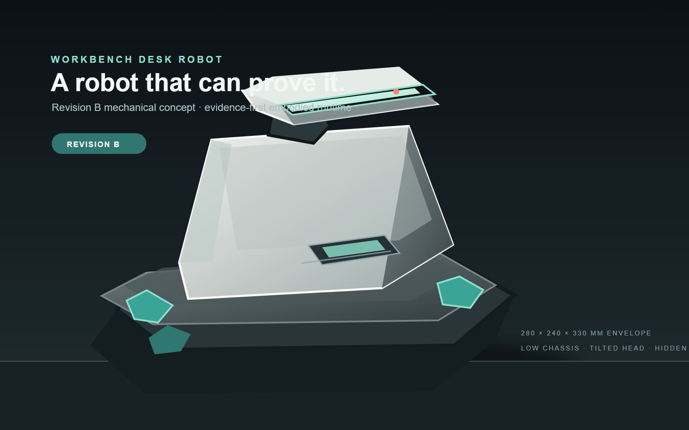

# Workbench Desk Robot

> **先验证，再说完成。**
>
> Workbench Desk Robot 是一个面向桌面机器人的证据优先基础：受限语义动作、
> 可回放事件日志，以及能够明确说出**已确认、未满足、证据不足**的验证器。



[](pyproject.toml)
[](LICENSE)
[](#诚实状态)

[English](README.md)

这个项目只问一个很实际的问题：**机器人真的完成任务了吗？我们能证明吗？**

当前机械基线是 **Revision B**：低底盘、渐缩肩壳、独立倾角头、内藏轮舱和可维护外壳。
主视觉基于受控机械包络绘制；真实外观、装配和尺寸仍需后续样机验证。

## 为什么值得做

很多机器人 Demo 把“命令发送成功”当成“任务完成”。于是机器人可能报告“已放置”，
但零件其实还在地上。

Workbench 把容易混在一起的几层拆开：

1. **意图**：模型只能选择受限的语义动作。
2. **执行**：受信运行时负责下发，并记录真实结果。
3. **验证**：动作之后检查证据，不静默报成功。
4. **回放**：完整事件轨迹可以检查、重建和复盘。

## 现在可以试什么

仓库当前提供确定性的离线桌面运行时，覆盖放置、三件套齐套、工件检验、清障恢复和
证据优先的快递入库分拣。

```bash
python tools/scripts/sim_cli.py doctor
python tools/scripts/sim_cli.py list
python tools/scripts/sim_cli.py run normal-001 --runner scripted --output-dir runs/demo
python tools/scripts/demo_scripted.py
```

脚本 runner 会生成可检查的 artifact：源 manifest、物化场景、事件日志、stdout/stderr、
metadata 和 checksums。它会明确标记为 `SCRIPTED_FIXTURE`，并保持
`release_eligible: false`。

## 核心能力

**证据优先验证**

- 三态任务结论：`confirmed`、`refuted`、`insufficient_evidence`
- 结构化证据引用，而不是一个裸的通过/失败字段
- 动作之后检查，并保留失败尝试和恢复历史

**契约驱动运行时**

- 11 个 JSON schema 定义模块边界
- 入口严格校验，并配套 Pydantic 模型
- 仅追加事件库，支持从检查点确定性回放

**受限的 Agent 行为**

- 模型只能路由 `observe`、`grasp`、`place`、`ask_confirm`、`express`、`stop`
- 关节位置、速度和硬件急停不在模型权限内
- 危险目标和越界目标默认失败关闭

**操作员可见性**

- 只读看板展示任务状态、证据、恢复和回放
- `doctor`、`list`、`run` 明确区分真实执行、fixture 和未执行
- 原子运行 artifact 保存原始日志、metadata 和 SHA-256 checksums

## 诚实状态

**现在可用：**确定性 Python runtime、五类任务、可回放事件日志、只读 dashboard、
本地模型路由、场景校验和失败关闭式仿真控制面。

**还没有：**完整 Gazebo 世界、真实相机桥接、MoveIt 抓取放置适配器、Gazebo 实测任务结果
和真实硬件证据。仓库中的 fixture 是软件链路测试，不是机器人或 Gazebo 证据。

同一 manifest 和 seed 会得到同一物化场景 hash，但这不意味着 Gazebo 物理、传感器噪声、
进程时序或事件顺序也完全确定。

## 快速开始

Ubuntu 24.04 或 WSL2，Python 3.12，不需要 GPU。

```bash
git clone https://github.com/Quchaosheng/workbench-desk-robot.git
cd workbench-desk-robot
make bootstrap
make demo-scripted
```

常用命令：

```bash
make test             # 单元和集成测试
make lint             # Ruff 检查
make scenario-check   # 场景 manifest 和确定性校验
make sim-doctor       # 诊断仿真依赖
make sim-list         # 列出场景和 scene hash
make sim              # 配置的 Gazebo runner；缺失时为 NOT_EXECUTED
make dashboard        # 启动只读本地看板
```

离线 fixture：

```bash
python tools/scripts/sim_cli.py run normal-001 --runner scripted --output-dir runs/demo
```

真实 runner 需要通过 `WORKBENCH_GAZEBO_COMMAND` 或 `--command` 提供 tokenized
argv。runner 会使用每个 manifest 的 timeout，限制 stdout/stderr 大小，在超时时终止整棵
进程树，并在发布 artifact 前校验事件日志。

## 架构边界

```text
目标 -> 受限规划器 -> 语义动作 -> 受信执行器
                         \-> 事件库 -> 验证器 -> 回放/看板
```

Dashboard API 只读。所有 HTTP 写方法返回 `405`；服务不会发布 ROS、运动、MCU 或硬件急停命令。

## 路线图

- **v0.1**：冻结回归基线和证据契约
- **v0.2**：五类脚本任务和恢复路径
- **下一步**：真实 Gazebo 世界、感知桥、语义运动适配器和仿真故障注入
- **更远**：不改变证据边界的硬件验证

## 文档

- [用户指南](docs/user-guide/index.md)
- [系统架构](docs/architecture/system.md)
- [仿真边界](sim/README.md)
- [分机部署](docs/deployment/multi-host.md)
- [安全策略](SECURITY.md)
- [贡献指南](CONTRIBUTING.md)

## 许可证

Apache-2.0。详见 [LICENSE](LICENSE) 和 [NOTICE](NOTICE)。
