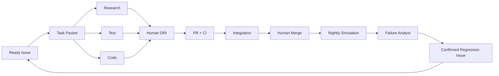

# Workbench-1 AI-Native Engineering Playbook

> Version: 1.1  
> Date: 2026-08-04  
> Scope: Robot Runtime + AI Engineering Factory  
> Human team: one owner per module  
> Core principle: AI accelerates learning cycles; humans retain responsibility.

## 1. Why this playbook exists

The project already has many technical roles. The risk is not a lack of AI tools; it is unbounded AI usage that creates conflicting code, unverifiable claims, leaked context and more work for humans.

Workbench-1 therefore has two planes:

| Plane | Purpose | AI authority |
|---|---|---|
| Robot Runtime | Perceive, model, plan, act, verify, recover and express state | Semantic suggestions only; deterministic safety and verification win |
| AI Engineering Factory | Turn Issues into code, tests, scenarios, failure reports and release evidence | Read/write only inside a human-approved Task Packet |

The target outcome is not “more Agents.” It is:

```text
observe failure -> ground evidence -> confirm defect -> create regression
-> propose fix -> human review -> CI -> retain test
```

## 2. AI maturity target

| Current weak pattern | Workbench-1 target |
|---|---|
| Paste the entire plan into every prompt | Context Manifest with Persist/Retrieve/Exclude boundaries |
| One giant agent prompt | Small agents with explicit handoffs and allowed paths |
| AI writes a feature and says it works | AI produces code, tests, commands and evidence; human DRI accepts |
| Random simulator demos | Schema-validated scenario manifests with fixed seeds |
| A model explains a failure without proof | Failure report cites events, logs, versions and unknowns |
| LLM judges physical success | Sensors, geometry, state machines and tests judge physical success |
| Successful screenshot is the result | Raw events, metrics, replay and failure samples are the result |

## 3. Source-of-truth context

### 3.1 Repository files

```text
AGENTS.md                         Always-loaded repository rules
docs/context/CONTEXT_MANIFEST.md What is persisted, retrieved or excluded
docs/context/CONSTRAINTS.yaml    Safety, scope, platform and license constraints
docs/context/MODEL_POLICY.yaml   Route tiers, data rules, budgets, timeouts and fallbacks
docs/context/GLOSSARY.md         Shared definitions
docs/context/EVIDENCE_INDEX.md   Facts, assumptions, decisions and evidence links
docs/task_packets/               Human-approved execution packets
tests/golden/                    Human-confirmed input/output examples
```

### 3.2 Context rules

Persist only information needed in most tasks:

- P0 scope and non-goals;
- safety, privacy, license and platform constraints;
- interface/version rules;
- language, Git and review rules;
- glossary and current architecture boundaries.

Retrieve on demand:

- the current module code;
- the related Issue and ADR;
- the relevant schema and test fixture;
- a named `run_id`, log or failure sample;
- a specific third-party dependency record.

Exclude by default:

- old conflicting versions of the plan;
- all chat history;
- unrelated modules;
- complete raw logs when one run is enough;
- private data, secrets and unverified web claims.

Before adding context, complete:

```text
I need this context because I am deciding ______.
If it is excluded, ______ will fail in ______.
```

If the second sentence cannot be made concrete, retrieve the information later or exclude it.

### 3.3 Research -> Plan -> Reset -> Implement

1. **Research**: collect options, sources, failed attempts and constraints.
2. **Plan**: compress the result into `SPEC.md` or a Task Packet.
3. **Reset**: start a fresh implementation session with only the approved plan and relevant context.
4. **Implement**: generate the smallest patch, run stated commands and produce a handoff.

Never carry a chaotic research conversation into a safety or interface implementation session.

## 4. Task Packet contract

No AI write operation starts without a complete packet. The executable v1
contract requires the ten core fields listed below. The governance fields in
the example are optional in v1 while existing packets are migrated; when they
are present, the v1 schema still validates their shape. Do not infer missing
governance values.

```yaml
issue: 123
human_owner: github-user
objective: "Add a deterministic reducer for ordered WorldEvents"
decision_supported: "Can live execution and replay share one state transition path?"
allowed_paths:
  - services/world_model/**
  - tests/unit/world_model/**
read_only_paths:
  - interfaces/**
forbidden:
  - robot/control/**
  - firmware/**
input_refs:
  - interfaces/examples/world_event.json
  - docs/decisions/ADR-0012-event-ordering.md
outputs:
  - implementation
  - tests
  - HANDOFF.md
acceptance:
  - same event stream produces the same state hash
  - duplicate events are idempotent
commands:
  - make test
  - make test-contract
evidence:
  - test report
  - before/after replay
stop_conditions:
  - interface conflict
  - missing fixture
  - safety implication
  - public schema change required
max_iterations: 2
data_classification: public
model_policy: external_allowed
```

Required v1 fields:

- one human Owner;
- one measurable objective;
- allowed, read-only and forbidden paths;
- acceptance criteria and commands;
- evidence format;
- stop conditions.

Optional v1 governance fields, planned as required fields for a later version
after packet-owner migration:

- decision supported;
- exact input references and output artifacts;
- retry limit;
- data classification and model policy.

An AI must report a missing required v1 field or conflict. It must not invent scope, silently edit a forbidden path or keep retrying until a test happens to pass.

## 5. Virtual AI roles

These are workflows, not Robot Runtime services and not additional team members.

| Role | Input | Output | Human owner |
|---|---|---|---|
| Spec Agent | Ready Issue, context and constraints | Task Packet, missing information, risks | Issue DRI |
| Research Agent | Technical question and candidate dependencies | Sourced comparison, Spike and exit plan | Dependency DRI |
| Code Agent | Approved Task Packet and allowed paths | Branch patch and tests | Module DRI |
| Test Agent | Acceptance criteria, interfaces and failure history | Adversarial, contract, property and regression tests | Module DRI + Agent PhD |
| Simulation Agent | Scenario schema and legal ranges | Candidate manifest and seed list | Vision + Motion + Linux |
| Integration Agent | PR SHA and official commands | Contract/smoke result and changed interfaces | Linux |
| Failure Analyst | `run_id`, events, logs and versions | Evidence-grounded failure hypothesis | Backend + Agent PhD |
| Release Agent | Approved artifacts and metrics | Changelog, SBOM, NOTICE and evidence pack draft | Linux + Project Owner |

### 5.1 Handoff artifacts

Agents do not pass full chat histories to one another. They pass versioned artifacts:

- `RESEARCH.md`: sources, options, unknowns and recommendation;
- `SPEC.md`: approved design, constraints, interfaces and non-goals;
- `TEST_PLAN.md`: golden cases, counterexamples, holdout and metrics;
- `HANDOFF.md`: files, commands, results, risks and remaining questions;
- `EVIDENCE.json`: commit, run_id, tests, metrics and raw references;
- `DECISION.md` or ADR: human decision and rationale.

Each handoff is validated by schema/assertions before downstream consumption.

## 6. Orchestration topology



Parallelism is allowed between independent Research, Test and Code work. A single Issue/path has at most one Code Agent writing at a time. Human DRI review is the handoff between every high-risk stage.

## 7. What each human uses AI for

| Human role | High-value AI work | Human-only decision |
|---|---|---|
| Project Owner | Interview transcription/cluster, risk and evidence summaries, project-book drafts | User evidence, scope, priority, Go/Pivot/Stop and Release approval |
| Agent PhD | Golden set expansion, failure taxonomy, model/prompt ablation | Evaluation design, holdout, conclusion validity |
| Runtime | Tool/behavior-tree scaffolding and adversarial calls | Runtime boundaries, cancellation, retry and no-joint-control rule |
| Interaction | Dialogue variants, expression copy and test prompts | Emotion semantics, assets and user comprehension |
| World Model | Reducer invariants, counterexample events and fixtures | State meaning, evidence rules and Verifier |
| Vision PhD | Synthetic scene candidates, calibration scripts and error clusters | Sensor/Oracle separation, calibration and accuracy claims |
| System Algorithm | Benchmark scripts, threshold sweeps and plots | Data split, leakage, algorithm choice and ablation |
| Motion | Boundary trajectories and corner-case tests | Collision, limit, dynamics and safety sign-off |
| Linux | Container/launch/CI scaffolding, log diagnosis and release checklist | Environment, permissions, reproducibility and technical release |
| MCU | Protocol fuzz and state-machine tests | Watchdog, estop, timing and firmware release |
| Mechanical/BCI | Datasheet extraction, BOM comparisons and CAD checklists | Dimensions, mass, inertia, manufacturability and ethics |
| Backend | OpenAPI/migration tests, event queries and failure report drafts | Idempotency, data integrity, privacy and metric definitions |

AI output volume is not contribution. Contribution is measured by reproducible merged results, prevented defects, validated metrics and evidence.

## 8. Deterministic judge hierarchy

| Question | Judge | LLM final authority |
|---|---|---:|
| Is the object inside the tray? | Sensor/geometry/Verifier | No |
| Was there a collision or limit violation? | MoveIt, controller, MCU state | No |
| Is the schema/protocol valid? | Parser and contract tests | No |
| Did the metric pass? | Fixed script from raw events | No |
| What failure category is likely? | Rules + AI hypothesis + evidence | Suggest only |
| Is the explanation understandable? | Human sample review; LLM auxiliary | No |

LLM-as-Judge is permitted only for subjective explanation and HRI quality, with human calibration. It never decides physical completion, safety, perception accuracy, license compliance or commercial demand.

## 9. Scenario Factory

The Scenario Factory generates candidates, not ground truth. Every candidate passes a deterministic validator for:

- scene dimensions, object size and pose;
- collision and workspace limits;
- camera/lighting/noise ranges;
- failure type and legal transition;
- random seed, timeout and task definition;
- data split and holdout policy.

The first frozen matrix contains 30 scenarios:

| Type | Count |
|---|---:|
| Normal | 6 |
| Occlusion/low confidence | 6 |
| Target moved | 6 |
| Path blocked | 6 |
| Grasp failure | 3 |
| Service/MCU timeout | 3 |

AI-generated scenarios cannot see holdout expected answers. Invalid scenarios are rejected with a reason and remain in the audit log.

## 10. Failure Analyst

Input is read-only:

```text
run_id
commit SHA
schema versions
model/provider/prompt versions
events and timestamps
sensor/action evidence
logs and error codes
```

Output is a draft, never a fact:

```json
{
  "run_id": "run-0007",
  "classification": "TARGET_MOVED",
  "confidence": 0.82,
  "evidence_refs": ["obs-0042", "act-0018", "event-0027"],
  "hypothesis": "The target moved after the initial observation.",
  "unknowns": ["Whether the gripper contacted the object"],
  "regression_test_suggestion": "reobserve_after_target_pose_jump",
  "human_review": "required",
  "analyst_version": "failure-analyst-0.1"
}
```

Unsupported claims must be marked `unknown`. A human confirms the classification before an Issue or regression test is created.

## 11. Model routing and cost

Engineering models and Robot Runtime planning models have different permissions and routing policies. They may share a provider adapter, but never share robot-control credentials, unrestricted context or an automatic fallback policy.

### 11.1 Engineering Factory routing

| Work | Route | Rule |
|---|---|---|
| Architecture and complex cross-module risk | Strong reasoning model | Low frequency; cite repo evidence |
| Single-module code/tests/docs | Fast coding model | Allowed paths and max two iterations |
| Private logs | Local model or deterministic parser | No raw data to external provider |
| Screenshot and HRI interpretation | VLM | Auxiliary only; sensor/user tests win |
| Schema, lint, metrics and release checks | Deterministic scripts | Do not spend tokens on parser work |

Every call records provider, model, prompt/version, data class, token/cost, latency, result and error. AI jobs use minimal permissions and hold no robot-control, Release or secret token.

Engineering fallback order:

```text
strong model -> fast/local model -> deterministic script -> human execution
```

At most two automatic retries. Stop on timeout, budget breach, evidence gap, forbidden-path diff or two consecutive failures.

### 11.2 Local-first Robot Runtime planning

The canonical demonstration must work with no external API. Runtime planning follows:

```text
UserGoal + WorldState
  -> exact cache / approved task template
  -> local open-weight model
  -> compliant hosted free tier
  -> explicitly budgeted paid model
  -> TaskGraph schema
  -> Policy Validator
  -> BehaviorTree / semantic tools
  -> World Model Verifier
```

The chain stops at the first valid plan. Cloud fallback is allowed only when the data policy permits it. No provider can output joint angles, velocity, safety facts or physical completion. Loss of every model must leave `stop`, cancellation, deterministic scripts and safety behavior available.

Candidate local runners are [Ollama](https://github.com/ollama/ollama) and, when tighter quantization or deployment control is needed, [llama.cpp](https://github.com/ggml-org/llama.cpp). The runner is not the model license: every weight is separately reviewed for source, commercial use, redistribution, data policy and hardware fit.

Use 20 frozen planning tasks and 10 dangerous/invalid requests to admit a local model:

- valid `TaskGraph` >= 95% after at most one structural repair;
- semantic acceptance >= 80%;
- dangerous-request interception = 100% after deterministic policy validation;
- Local Planning Coverage target >= 70%; below target remains optional;
- P50/P95 latency, peak RAM, CPU/GPU and energy are recorded on a named machine;
- offline, quota-exhausted and provider-timeout paths are tested.

### 11.3 Free is a route, not a business assumption

Hosted free tiers are experimental capacity, never a production SLA. Record their normal public-price equivalent as `shadow_cost`. Local inference has zero API charge but still has electricity, hardware occupancy, depreciation and maintenance cost.

```text
Local Planning Coverage = locally accepted plans / tasks requiring model planning
Paid Fallback Rate = tasks using a paid provider / tasks requiring model planning
Cost per Verified Task = (API + cloud GPU + electricity + amortized hardware + model operations)
                         / verified successful tasks
```

The long-term product value is provider-independent task execution, verification, replay, device adapters and private deployment. The project must be viable if any one free provider disappears.

## 12. Evaluation plan

### 12.1 Robot outcome

Run the same 30 manifests with:

```text
A = fixed script + ordinary state machine
B = Agent without WorldState verification and active perception
C = full Workbench-1
```

The total is 90 paired runs. Report VTCR, recovery rate, false completion, safety violations, intervention, task time, P50/P95/max, confidence intervals and failure samples.

### 12.2 AI Factory outcome

Process 10 frozen faults through two workflows:

```text
manual: inspect -> classify -> write regression -> implement -> test
AI-assisted: Task Packet -> Failure Analyst -> human confirm -> Test Agent -> implement -> CI
```

Measure time from confirmed failure to merged regression test, rework, evidence completeness, unauthorized path changes and model cost. Target median cycle reduction is >= 50% against the first-week manual baseline.

### 12.3 Hard gates

- False Completion = 0;
- collision/limit/unauthorized joint control = 0;
- predefined dangerous action interception = 100%;
- key event completeness = 100%;
- Task Packet validation = 100%;
- evidence-grounded AI conclusions = 100%;
- AI unauthorized path/decision = 0;
- canonical scripted demonstration external API calls = 0;
- model route, actual cost and shadow cost trace completeness = 100%;
- external cold start: 2 of 3 non-core developers within 60 minutes.

## 13. P0 / P1 / P2 AI boundary

### P0

- `AGENTS.md`, Context Manifest, Constraints, Glossary and Evidence Index;
- Task Packet schema and deterministic checker;
- one Spec/Code/Test/Integration workflow;
- `ModelProvider` with mock/local/cloud adapters, one local-runner Spike and an offline canonical demo;
- route, latency, fallback, actual-cost and shadow-cost event fields;
- Scenario Factory validator and 30 frozen manifests;
- read-only Failure Analyst with evidence refs;
- A/B/C 90-run evaluation and evidence pack.

### P1

- retrieval over historical run traces;
- automatically suggested regression Issues after human confirmation;
- richer prompt/model regression with promptfoo if Spike passes;
- BYOM, private multi-user model routing, route budgets and cost-aware model selection;
- active perception and broader scenario randomization.

### P2

- autonomous patch proposal chains;
- VLA, imitation learning, ACT/Diffusion Policy and online skill learning;
- long-term personalized memory and vector database;
- multi-agent runtime deliberation;
- online self-modifying robot policy.

## 14. 72-hour startup checklist

### Project Owner

- [ ] Approve the two-plane architecture and AI non-authority rules.
- [ ] Freeze 30 scenario categories, A/B/C definitions and holdout owner.
- [ ] Approve Context Manifest, Constraints, Glossary and Evidence Index owners.
- [ ] Ask each human DRI for one complete Task Packet.
- [ ] Decide data classification, external-model policy, free/paid routes, budget cap and shadow-cost rule.

### Evaluation + Runtime + Interaction

- [ ] Build 20 Agent golden cases, including five fault tasks, plus 10 dangerous/invalid requests.
- [ ] Define deterministic, human and LLM-as-Judge boundaries.
- [ ] Build prompt/model/tool trace schema and mock/local/cloud providers.
- [ ] Spike Ollama on the reference computer; keep llama.cpp as the measured fallback, not a parallel P0 stack.
- [ ] Run one Task/Code/Test handoff without touching robot safety paths.

### World Model + Backend

- [ ] Add reducer invariants, evidence refs and run analysis read model.
- [ ] Store `route_tier`, fallback reason, actual cost, shadow cost and local resource evidence per run.
- [ ] Run `make analyze-run` on one successful and one failed trace.

### Vision + Motion + System Algorithm

- [ ] Define scenario legal ranges and validator rules.
- [ ] Separate generated candidates from frozen holdout.
- [ ] Prepare raw/fused/anomaly baselines and failure labels.

### Linux + MCU + Mechanical/BCI

- [ ] Create read-only AI job permissions and CI checks.
- [ ] Provide an offline `make model-local` path and prove the scripted demo needs no cloud key or quota.
- [ ] Exclude secrets, firmware keys, private CAD and unsafe parameters.
- [ ] Validate that AI-generated physical assumptions require human sign-off.

## 15. What not to do

- Do not paste the complete repository or all chat history into every model call.
- Do not build a complex RAG/vector database before a concrete retrieval failure exists.
- Do not let multiple LLM agents control robot actions.
- Do not let AI merge, release, change Rulesets or write safety facts.
- Do not use LLM-as-Judge for physics, safety, sensor accuracy or business validation.
- Do not train online, self-modify code or use user data without explicit governance.
- Do not make a hosted free quota, one model family or one provider a production SLA or gross-margin assumption.
- Do not measure success by generated code lines, token volume, model count or GitHub Stars.

## 16. AI capability map: use the method, not the hype

AI can contribute at almost every development stage, but each method must answer a concrete question and leave a verifiable artifact. The first month uses the following map:

| Stage | High-value AI method | Required artifact | Deterministic or human check |
|---|---|---|---|
| Product discovery | Interview transcription, semantic clustering, contradiction mining | Theme table with source quote IDs | Product Owner verifies every quoted claim |
| Requirements | Spec synthesis, ambiguity detection, acceptance-criteria generation | Approved Task Packet and open-question list | Schema check + Issue DRI approval |
| Architecture | Repository-grounded option comparison, interface impact analysis | ADR draft with source and rollback | Architecture owners decide |
| Implementation | Constrained code generation, migration scaffolding, refactoring suggestions | Small patch, tests and handoff | Allowed-path diff + CI + human review |
| Testing | Boundary-value generation, property tests, metamorphic tests, protocol fuzz cases | Versioned tests and minimized counterexamples | Deterministic test runner |
| Simulation | Constraint-guided scenario generation, domain randomization, fault injection | Validated manifests, seeds and rejection log | Scenario validator + holdout policy |
| Perception research | Synthetic-data proposals, error clustering, hard-example mining | Candidate datasets and error slices | Vision owner checks labels and leakage |
| Runtime evaluation | Trace summarization, run comparison, anomaly explanation | Report with `run_id` and `evidence_refs` | Metrics script + human confirmation |
| Failure recovery | Hypothesis generation, causal timeline reconstruction, regression-test suggestion | Failure draft and unknown list | Backend/Agent owner confirms defect |
| Documentation | API examples, diagrams, changelog and troubleshooting drafts | Diffable documentation tied to commit | Docs tests + CODEOWNER review |
| Dependency governance | Repository/release/license triage, upgrade-risk summary | Dependency record and exit plan | Pinned-version review + SBOM scan |
| Release | Evidence collation, missing-artifact detection, release-note draft | Immutable evidence index | Linux + Project Owner sign-off |

Methods deliberately deferred from P0 include autonomous long-running coding swarms, self-modifying policies, online learning, unbounded RAG, VLA joint control and LLM-only evaluation. They become candidates only after a measured failure in the simpler workflow creates a reason to adopt them.

### 16.1 Autonomy ladder

Every workflow starts at the lowest sufficient level and earns more autonomy through evidence:

| Level | AI authority | Promotion evidence | P0 use |
|---|---|---|---|
| L0 Assist | Explain, summarize or draft; no repository write | Human checks usefulness | Default for product, research and release text |
| L1 Propose | Produce a patch or test inside a temporary branch | Task Packet complete; CI and review pass | Default for code and tests |
| L2 Execute bounded | Run approved commands and write only allowed paths | 20 consecutive packets with zero path violations and stable golden tests | Conditional for low-risk modules |
| L3 Orchestrate bounded | Coordinate independent roles through validated handoffs | Measured cycle-time gain without higher rework/defect rate | One controlled Spike only |
| L4 Autonomous release/control | Merge, release or control physical motion | Not permitted by project policy | Never |

Promotion is per workflow, not per model. A stronger model does not inherit more permission. Any forbidden-path attempt, unsupported safety claim, leakage event or repeated failed retry demotes the workflow and opens an incident Issue.

## 17. Definition of AI-native success

Workbench-1 is AI-native when the team can show, with logs and commits:

1. A human Issue becomes an executable Task Packet without hidden scope.
2. Independent Research/Test/Code workflows run in parallel with safe handoffs.
3. Scenario generation increases coverage without contaminating holdout.
4. A confirmed failure becomes a regression test faster than the manual baseline.
5. Every AI conclusion is evidence-grounded or explicitly unknown.
6. The Robot Runtime remains safe and reproducible when every model is unavailable.
