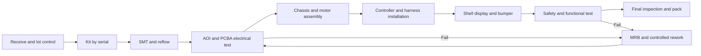

# Assembly work instructions

## Process flow

The route and timing source of truth is `routing.csv`. The following instructions
supplement the drawing and never override a drawing tolerance or safety requirement.

## Workstation instructions

1. **Receive / kit:** quarantine unlabelled material. Verify part number, revision,
   lot, quantity, damage, supplier declaration, and moisture-sensitivity status.
   Print the serial traveller only after the BOM revision matches the work order.
2. **SMT / reflow:** verify stencil revision and paste expiry; record first-piece
   paste coverage. Load the approved centroid/BOM. Run the locked SAC305 profile;
   do not hand-edit placements without an ECN. Segregate the first article for AOI.
3. **PCBA inspect / test:** inspect polarity, bridges, tombstones, void-sensitive
   power pads, and 8 mm isolation barrier. Test behind a shield with current-limited
   36 V input, then measure 12V_ISO, JETSON_12V, 3.3 V, ripple, isolation, E-stop input, and CAN.
4. **Chassis:** install motor brackets loosely, reference the datum fixture, torque
   M3 steel fasteners to 0.55 N m and marked plastic fasteners to 0.25 N m unless the
   drawing states otherwise. Apply witness mark after calibrated torque is recorded.
5. **Controller / protective bond:** fit stand-offs, board, insulating barriers, and
   protective/chassis bonds. Measure bond resistance below 0.10 ohm using four-wire
   compensation. No harness may be trapped under the PCB or touch a sharp edge.
6. **Harness:** mate only matching keyed connectors; verify two-stage latch engagement.
   Maintain 5 mm edge clearance, bend-radius rules, service loops, and separation of
   48 V, switch nodes, CAN, and ADC wiring. Use `harness-spec.csv` for wire gauge,
   length, color, shielding and bend radius. Fit strain relief before continuity test.
7. **Shell / display:** clean the display window, attach its bracket at the 8 degree
   datum, perform gap/flush inspection, install the TPU bumper, and confirm that vents
   are unobstructed. Do not use adhesive outside the controlled dispense drawing.
8. **Safety / functional:** with wheels restrained, verify power-off, input current,
   rail sequence, E-stop trip and latched reset, CAN at both ends, sensors, display,
   motor-enable interlock, and 30-minute thermal soak. Store raw fixture JSON by serial.
9. **Final / pack:** audit fastener marks, labels, cosmetic zones, evidence records,
   accessories, transit locks, desiccant/humidity indicator where required, and carton ID.

## Stop conditions

Stop the line for any E-stop failure, isolation-barrier contamination, protective
bond failure, smoke/odour, repeated identical defect on three consecutive units,
unknown drawing revision, expired calibration, or defect escape from an earlier gate.
